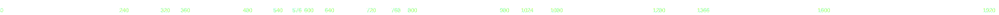

# ruler-svg
Vérifiez que l'image est bien alignée sur le bord gauche de votre écran et que le contenu de votre image SVG à bien une couleur de fond
```html
<style>
    body {
        margin: 0;
        background-color: rgba(51, 82, 113, 0.8);
    }
</style>
```

```html

```